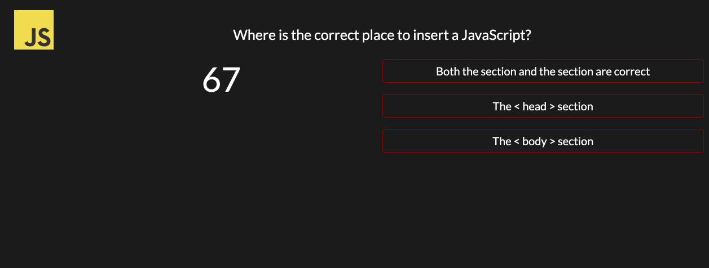

#  Code Quiz

## Introduction
This Code Quiz will test you on your JS skills but, you must do it fast because time is running. Everytime you get a wrong answer, you will get penalize. Good Luck!

ps. You can see your highscores 🌟

## Code 

```js
// start quiz
function startQuiz(){
    // hides paragraph of instructions
    instructions.style.display = "none";
    // hides start button
    start.style.display = "none";
    // starts to makes the questions
    makeQuestion();
    // questions appears 1 by 1 
    quiz.style.display = "block";
    // time starts counting
    makeCounter();
    TIMER = setInterval(makeCounter,1000); 
}
``` 


``` js
// using local storage to view history of highscores
function highscores() {
    var highscoreDisplay = JSON.parse(localStorage.getItem("highscore"));
    // console.log(highscoreDisplay)
    // hihgscore table will appear 
    scoreDiv.style.display = "block";
    for (let i = 0; i < highscoreDisplay.length; i++) {
        var p = document.createElement("p");
        p.textContent = "Initials: " + highscoreDisplay[i].initials + "  |  Highscore: " + highscoreDisplay[i].highscore
        scoreDiv.appendChild(p)
    }
}

```

## Technologies
* HTML
* CSS
* JS

## Instalation
1. On GitHub, navigate to the main page of the repository.
2. Under the repository name, click Clone or download.
3. To clone the repository, click "Clone with HTTPS".
4. Open Terminal.
5. Change the current working directory to the location where you want the cloned directory to be made.
6. Type git clone, and then paste the URL you copied in Step 2.
7. Press Enter. Your local clone will be created.

## Authors
* Lilliana Ramos

